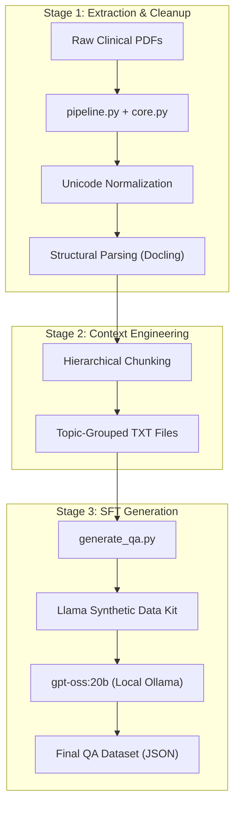

# Project Rundown: Medical SFT Data Pipeline

This document provides a microscopic breakdown of the pipeline's architecture, data flow, and the logic behind our "Scientist's Approach" to dataset generation.

## 1. High-Level Flow

The pipeline is a three-stage transformation process designed to turn unstructured medical PDFs into high-quality, clinical-grade training data.

---

## 2. Microscopic Code Breakdown

### `src/core.py`: The Hardware & Quality Guard
*   **Dual-GPU Detection**: It uses `torch` to detect the environment. If it finds an NVIDIA GPU, it initializes `AcceleratorDevice.CUDA`. If it finds a Mac, it uses `AcceleratorDevice.MPS`. This ensures maximum speed on both your 3x 3090s and your local machine.
*   **Unicode Sanitization**: Medical PDFs often contain non-standard characters (like the `\u2011` non-breaking hyphen). `clean_text()` normalizes everything to NFKC standard to prevent training artifacts.

### `src/pipeline.py`: The Context Architect
*   **Hierarchical Clustering**: Instead of just cutting text at arbitrary lengths, this script uses `HierarchicalChunker`. It extracts the "Breadcrumb" (e.g., *Management > Surgery > Complications*) for every chunk.
*   **Topic Grouping**: This is the "Scientist's Choice." We group related chunks into a single Topic file. This provides the LLM with a coherent logical context, allowing it to generate "Real-Life" scenarios rather than trivia.

### `src/generate_qa.py`: The Generator Engine
*   **SDK Integration**: It interfaces directly with the `synthetic-data-kit` Python API.
*   **Two-Pass Generation**: For every topic, it first asks the model to generate a **Summary** (for internal world-building) and then generates the **QA pairs**.

### `config/sft_config.yaml`: The Brain
*   **Expert Personas**: We explicitly instruct the model to behave as a "Distinguished Medical Consultant."
*   **Strict Constraints**: It forbids triviality and mandates "Clinical Depth" and "Long-Form Answers."

---

## 3. GPU Power Management (3x 3090)
To maximize your 3x 3090s, we use two separate paths:
1.  **Extraction (Docling)**: Uses Torch's CUDA backend to parallelize the layout analysis and OCR.
2.  **Inference (Ollama)**: Ollama load-balances across all 3 GPUs. By using the `gpt-oss:20b` model, we utilize the massive VRAM of your 3090s for high-quality reasoning that smaller models miss.

---

## 4. Why This Works for SFT
Standard RAG often fails in medicine because context is fragmented. This pipeline ensures:
- **Zero Hallucination**: Every answer is strictly grounded in the grouped topic text.
- **Structural Integrity**: Tables and lists are kept whole within chunks.
- **Human-Like Reasoning**: The prompts force the model to explain *why* a clinical action is taken, which is critical for fine-tuning a model to "think" like a doctor.
